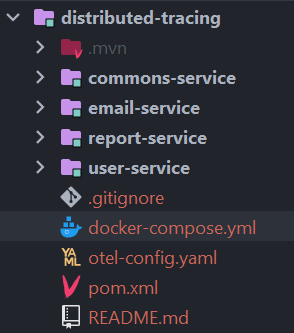

# Using Distributed Tracing With OpenTelemetry, Sleuth, Kafka, Jaeger and Spring boot

Distributed tracing gives you insight into how a particular service is performing as part of the whole in a distributed
software system. It tracks and records requests from their point of origin to their destination and the systems through
which they pass.

Let’s first take a look at some basic terms in distributed tracing.

### Span

The "**span**" is the primary building block of a distributed trace, representing an individual unit of work done in a
distributed system.

### Trace

The collection of Spans that have the same root is considered to create a group called trace.

## Requirements 🛠

- Git
- JDK 17
- Apache Maven

## How to Run 🚀

Execute the docker-compose and then execute all services (email-service, user-service and report-service)

```sh
docker-compose up -d

mvn clean install

# Runing user-service
cd user-service
mvn spring-boot:run

# Runing email-service
cd email-service
mvn spring-boot:run

# Runing report-service
cd email-service
mvn spring-boot:run
```

## Libraries used 📖

- [**OpenTelemetry**](https://opentelemetry.io): also known as OTel for short, is an open source observability framework with ready-to-use
  implementations to enable the effective creation and collection
  of telemetry data (metrics, logs, and traces) and to forward them
  to external tools.
- [**Spring Cloud Sleuth**](https://spring.io/projects/spring-cloud-sleuth): is a project managed and maintained by Spring Cloud team that provides Spring Boot
  autoconfiguration for distributed tracing.
- [**Jaeger**](https://www.jaegertracing.io): is an open source project with end-to-end distributed tracing to Monitor and troubleshoot transactions
  in complex distributed systems
- [**Maven**](https://maven.apache.org/): Build and dependency control
- [**H2 Database**](https://www.h2database.com/html/main.html): is a relational database management system written in Java. It can be embedded in Java applications or run in client-server mode. The software is available as open source software Mozilla
- [**Actuator**](https://docs.spring.io/spring-boot/docs/current/actuator-api/htmlsingle/): is mainly used to expose operational information about the running application — health, metrics, info, dump, env, etc.

## System Design Architecture 🗼

Let’s design three Spring Boot microservices:

* `user-service`: a simple user CRUD service. In addition to persisting data to its database, it providing HTTP API to calls the backend report service via REST API calls.
* `report-service`: a simple report CRUD service, it providing HTTP API to the user-service and also publishes events to Kafka when generating a new report record.
* `email-service`: Providing KafkaConsumer, listening to the topic reports.

<p align="center">
  
  <br/>
  <span>Figure 1: System design architecture for this project</span>
</p>

## Package Structure 📦

Using a monorepo, we have the project structure as follows:

<p align="center">
  
  <br/>
  <span>Figure 2: Project structure using monorepo</span>
</p>

